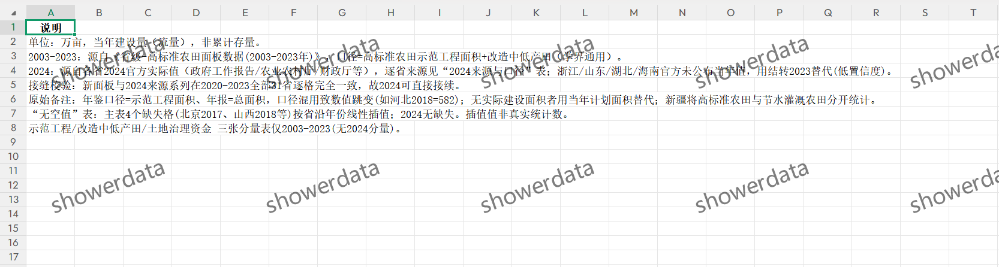
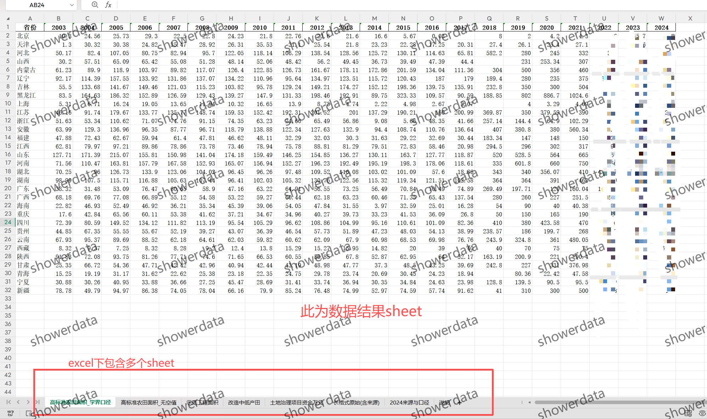
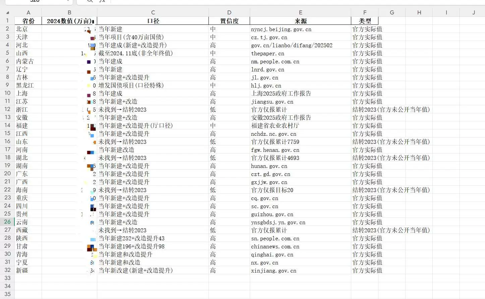
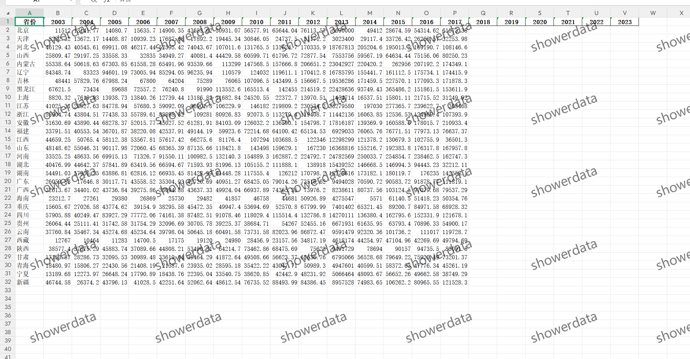
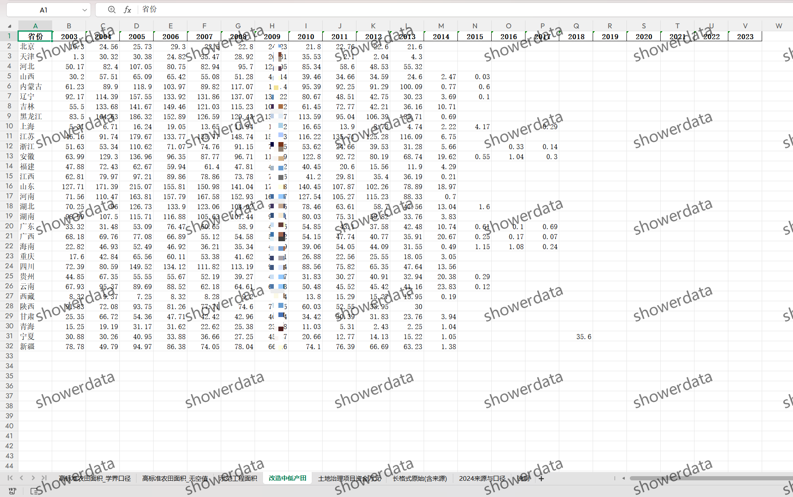
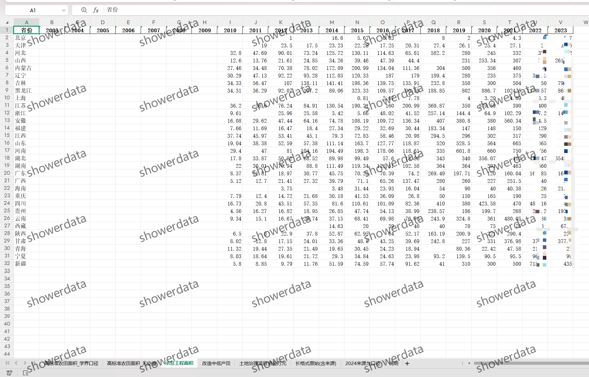
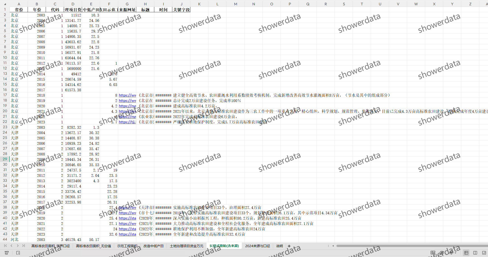

## Body

（2003-2024年）省级-高标准农田面积数据

注意事项：数据情况见下方图片，拍前请看清楚！已完整展示说明，请确定好是不是自己需要的再拍下！发货后任何理由不退不换！拍前请确认自己会使用再拍，不提供答疑，谢谢！数据可能会有客观原因所致缺失值，介意勿拍，谢谢！

一、数据介绍
（1）数据名称：省级-高标准农田面积
（2）样本范围：2003-2024年，31个省
（3）结果数据格式：excel
（4）数据内容：内含8个sheet学界口径/补充插值、示范工程面积、改造中低产田、土地治理项目资金万元、长面板格式原始数据含来源、2024来源及口径、说明
（5）数据来源：中国区域经济统计年鉴、各省统计年鉴

二、数据结果指标如图所示
年份、省份名称、代码（ID，非行政代码）、高标准农田面积（万亩）

三、测算方法无

四、参考文献无

## Images

Here is a pay link on Stripe ( https://buy.stripe.com/3cs8yP7sY87d0vu9AB ). Please contact me lonlonago@foxmail.com after funding $89, and I will send you a complete data files , thank you!

